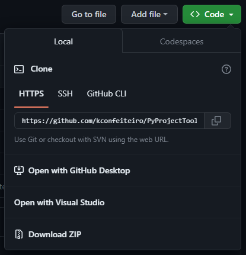

# Introduction

PyProjectTools is a powerful open-source toolkit that streamlines Python project development. It offers essential utilities and efficient workflows for projects of all sizes, simplifying creation, organization, and management. From virtual environments and package management to testing and documentation, boost your productivity with PyProjectTools. This repository will be continuously maintained by its owner, including documentation, and staying up to date with used libraries. Collaboration and additional contributions are welcome and encouraged!

## Disclaimer
The code in this repository was written using version `Python 3.11.4`, meaning, there might be compatibility issues with older Python versions. You can download version 3.11.4 [here](https://www.python.org/downloads/windows/).

# Usage

All you need to do to use the functions is clone the repository locally by typing

```
git clone https://github.com/kconfeiteiro/PyProjectTools
```
in your `cmd` (opened in your working directory). Then, you can call functions from the `PyProjectUtils` directory.

For future use, `clonePyProjectTools.bat` has been added to ease the cloning process for multiple projects. The URL does not change, so this can be used as long as need. To run the batch file, simply type

```cmd
clonePyProjectTools.bat
```
in your terminal. Or, click the icon for the `.bat` file from your computer's native file explorer.


## Pip Packages

 If you are missing `pip` packages, do not forget to install the `requirements.txt` using the terminal command

```
py -m pip install -r requirements.txt
```

Make sure to be in the directory of the cloned repository, `PyProjectTools`, while `pip` installing the requirements. You can also use a similar command as [Pull Requests](https://github.com/kconfeiteiro/PyProjectTools#pull-requests):

```
cd PyProjectTools & py -m pip install -r requirements.txt & cd ..
```

which will change your directory to that of the registry, then `cd ..` will automatically return you to your working directory.

## Calling Functions

The layout of the directory is (after its cloned)

```
< Your working directory >
   |   main.py
   └─── PyProjectUtils
         |
         └─── Utils
              │   DataSaving.py
              │   FileReading.py
              │   FileSorting.py
              │   Tools.py
              │   __init__.py
```

which means to call functions in your main script (`main.py`, in this example), use

```py
from PyProjectUtils.Utils import Tools
```

(for example) to import an entire script. If you would like to call a specific class only, use

```py
from PyProjectUtils.Utils.Tools import Tools
```

Note that if you make changes to the cloned repository, they will not be reflected on GitHub.

### Working Example

```py
# import the class 'Directories' from the FileSorting script
from PyProjectUtils.Utils.FileSorting import Directories as dr

# call function from the imported class
filepath = 'example/path/to/dir'
dr.mkdir(filepath)
```

where the function `dr.mkdir()` creates a directory if it does not exist.

## Pull requests

Pull requests are automatically completed. To pull new changes, use the command

```
cd PyProjectTools & git pull https://github.com/kconfeiteiro/PyProjectTools & cd ..
```

in your terminal (opened in your working directory). You can also simply use `cd PyProjectTools & git pull & cd ..`

### Git not Downloaded

If you do not have git downloaded and configured, the commands above will not work in your terminal. If this is the case, you can simply download the repository as a `.zip` file by clicking *Download Zip* in the green `<> Code` dropdown menu:



# Issues and Collaboration

If there are any issues, bugs, or broken functions feel free to contact confeitk@outlook.com. Or, if you would like to add your own functions, feel free to fork the repository!
